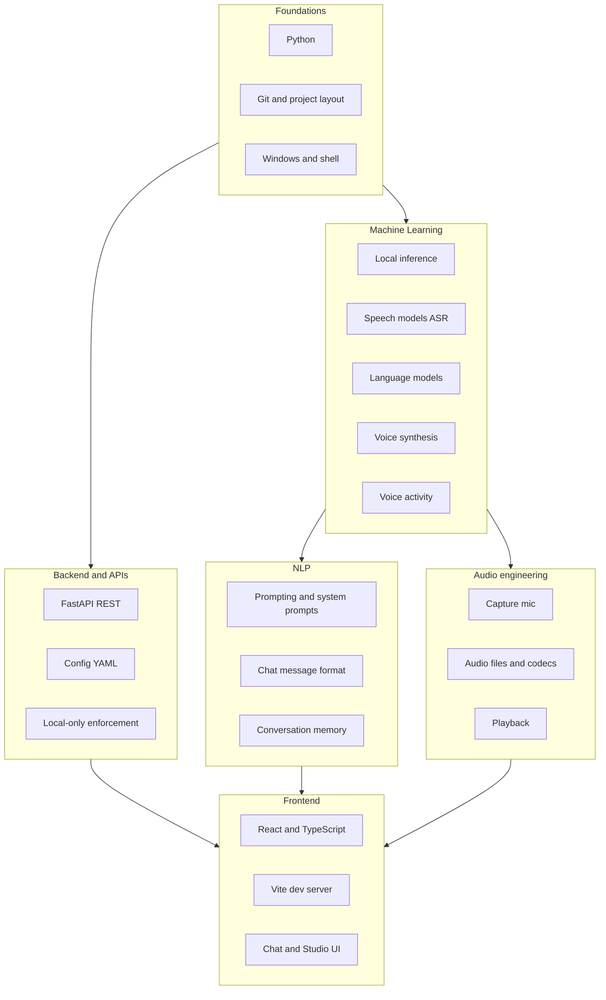
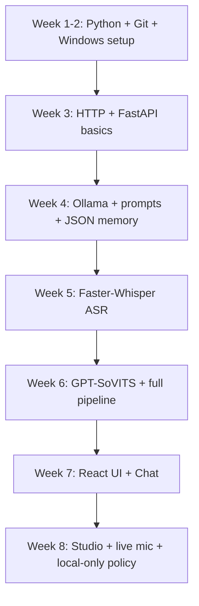

# Byulie Learning Path

**A living study map of everything this project touches — organized like a [machine learning roadmap](https://roadmap.sh/machine-learning), but grounded in code you actually built.**

Use this document to revisit topics, see where each skill shows up in Byulie, and track what to study next.

---

## How to use this guide

| Symbol | Meaning |
| --- | --- |
| `[ ]` | Not studied yet |
| `[~]` | In progress (you used it in Byulie but want deeper theory) |
| `[x]` | Comfortable enough to explain it to someone else |
| **In Byulie →** | File(s) where the concept appears in this repo |

Update checkboxes as you learn. Re-read sections after major project changes.

---

## Master map (what Byulie is made of)

---

## Progress overview

| Domain | Topics in Byulie | Your status |
| --- | --- | --- |
| [1. Foundations](#1-foundations) | Python, terminal, project structure | `[ ]` |
| [2. Python (applied)](#2-python-applied) | Modules, venv, HTTP, files, async basics | `[ ]` |
| [3. Machine learning](#3-machine-learning) | Local inference, models, VRAM, tradeoffs | `[ ]` |
| [4. NLP](#4-natural-language-processing-nlp) | Prompts, chat API, context, personality | `[ ]` |
| [5. Speech and audio](#5-speech-and-audio) | ASR, TTS, VAD, microphones | `[ ]` |
| [6. Backend engineering](#6-backend-engineering) | FastAPI, config, pipeline orchestration | `[ ]` |
| [7. Frontend engineering](#7-frontend-engineering) | React, live mic, dev studio | `[ ]` |
| [8. Systems and integration](#8-systems-and-integration) | Full pipeline, launchers, local-only policy | `[ ]` |

---

## 1. Foundations

*What you need before the AI stack makes sense.*

### 1.1 Computer science basics

| Topic | Why it matters for Byulie | In Byulie → |
| --- | --- | --- |
| `[ ]` Client–server model | Browser talks to API; API talks to Ollama/GPT-SoVITS | `client/web/`, `server/api/` |
| `[ ]` Localhost (`127.0.0.1`) | Everything runs on your machine, not the cloud | `server/local_only.py`, `character_config.yaml` |
| `[ ]` Processes and ports | `:8000` API, `:5173` web, `:11434` Ollama, `:9880` TTS | `scripts/start_byulie.ps1`, README |
| `[ ]` Files and paths | Config, history JSON, audio WAVs | `server/paths.py` |

### 1.2 Windows development environment

| Topic | Why it matters | In Byulie → |
| --- | --- | --- |
| `[ ]` PowerShell basics | Run setup, venv, Ollama commands | README, `Start-Byulie.bat` |
| `[ ]` Virtual environments (`.venv`) | Isolated Python packages | `scripts/start_byulie.ps1` |
| `[ ]` PATH and executables | `python`, `ollama`, `ffmpeg` | README prerequisites |
| `[ ]` Microphone permissions | Web and CLI need mic access | README troubleshooting |

### 1.3 Git and project organization

| Topic | Why it matters | In Byulie → |
| --- | --- | --- |
| `[ ]` Repo layout (`client/`, `server/`, `scripts/`) | Separation of UI vs logic | Whole repo |
| `[ ]` Config vs code | Behavior changes without rewriting Python | `character_config.yaml` |
| `[ ]` `.gitignore` | Don’t commit venv, audio, history | `.gitignore` |

**Study next (external):** [Machine Learning Roadmap — foundations](https://roadmap.sh/machine-learning) (scroll to prerequisites and companion fields).

---

## 2. Python (applied)

*The language that wires the pipeline together.*

### 2.1 Core Python

| Topic | In Byulie → |
| --- | --- |
| `[ ]` Imports and packages (`server.process...`) | All `server/` modules |
| `[ ]` `pathlib.Path` for cross-platform paths | `server/paths.py` |
| `[ ]` Reading/writing JSON | `server/process/llm_funcs/llm_scr.py` |
| `[ ]` Reading/writing YAML | `server/api/config_store.py`, `character_config.yaml` |
| `[ ]` Functions and module-level state | `llm_scr.py` (`reload_from_config`) |
| `[ ]` `argparse` CLI flags | `server/main_chat.py` (`--live`) |

### 2.2 Libraries you use directly

| Library | Role in Byulie | In Byulie → |
| --- | --- | --- |
| `[ ]` **requests** | HTTP to Ollama and GPT-SoVITS | `llm_scr.py`, `sovits_ping.py`, `services.py` |
| `[ ]` **PyYAML** | Load/save character config | `config_store.py` |
| `[ ]` **numpy** | Audio level math for VAD (CLI) | `server/process/asr_func/live_mic.py` |
| `[ ]` **sounddevice** | Record from microphone (CLI) | `asr_push_to_talk.py`, `live_mic.py` |
| `[ ]` **soundfile** | Read/write WAV files | `main_chat.py`, `asr_push_to_talk.py` |
| `[ ]` **faster-whisper** | Speech-to-text (ASR) | `services.py`, `main_chat.py` |
| `[ ]` **FastAPI** | REST API for web app | `server/api/main.py` |
| `[ ]` **uvicorn** | Run the API server | README, launcher scripts |
| `[ ]` **pydantic** | Request body validation | `server/api/main.py` |
| `[ ]` **gradio** (legacy UI) | Optional simple web UI | `client/app.py` |

### 2.3 Patterns worth mastering

| Pattern | Example in project |
| --- | --- |
| `[ ]` Thin API layer, fat services | `main.py` routes → `services.py` pipeline |
| `[ ]` Reload config without restart | `reload_from_config()`, Studio save |
| `[ ]` Guard rails (local-only URLs) | `server/local_only.py` |

---

## 3. Machine learning

*Models and inference — the “AI” in voice AI.*

> Broader industry map: [roadmap.sh/machine-learning](https://roadmap.sh/machine-learning)

### 3.1 ML concepts (theory)

| Topic | How Byulie uses it | Status |
| --- | --- | --- |
| `[ ]` **Inference vs training** | You only run pre-trained models locally | |
| `[ ]` **Model weights** | Downloaded once (Ollama pull, Whisper cache) | |
| `[ ]` **CPU vs GPU** | ASR on CPU by default; GPU helps LLM/TTS | `character_config.yaml` → `asr.device` |
| `[ ]` **VRAM and tradeoffs** | Can’t run huge models + everything on GPU at once | README troubleshooting |
| `[ ]` **Temperature / sampling** | Controls randomness of replies | Studio sliders, `llm.temperature` |
| `[ ]` **Context window** | How much history the LLM sees | `llm.context_tokens` |
| `[ ]` **Quantization** (intro) | Smaller models like `qwen3:4b` fit consumer GPUs | Ollama model choice |

### 3.2 Model roles in the pipeline

| Model type | Tool | Input → output | In Byulie → |
| --- | --- | --- | --- |
| `[ ]` **ASR** (Automatic Speech Recognition) | Faster-Whisper | Audio → text | `asr_push_to_talk.py`, `services.py` |
| `[ ]` **LLM** (Large Language Model) | Ollama | Text history → reply text | `llm_scr.py` |
| `[ ]` **TTS** (Text-to-Speech) | GPT-SoVITS | Text + reference voice → audio | `sovits_ping.py` |

### 3.3 Local ML stack (your choices)

| Component | Default | What to learn |
| --- | --- | --- |
| `[ ]` Ollama | `qwen3:4b` | Pull models, `ollama serve`, chat API |
| `[ ]` Faster-Whisper | `base.en` | Model sizes (`tiny` → `large`), `device`, `compute_type` |
| `[ ]` GPT-SoVITS | Local server | Reference audio, prompt text, endpoint |

### 3.4 Voice activity (lightweight “ML”)

| Topic | In Byulie → |
| --- | --- |
| `[ ]` Energy / RMS thresholding | `live_mic.py`, `useMicrophone.ts` |
| `[ ]` End-of-utterance detection | Live listen mode (web + CLI `--live`) |

**Experiments to deepen ML learning**

- [ ] Change `asr.model` to `tiny.en` vs `base.en` — compare speed and accuracy.
- [ ] Change `llm.model` in Studio — compare reply quality and speed.
- [ ] Run `nvidia-smi` while chatting — observe VRAM.

---

## 4. Natural language processing (NLP)

*Text understanding and generation.*

### 4.1 Conversational NLP

| Topic | In Byulie → |
| --- | --- |
| `[ ]` **System prompt** | Persona, rules (“senpai”, tone) | `character_config.yaml` → `presets.default.system_prompt` |
| `[ ]` **User / assistant messages** | Chat transcript format | `llm_scr.py` → `messages` list |
| `[ ]` **Multi-turn context** | Prior turns sent to Ollama | `load_history()`, `byulie_chat_history.json` |
| `[ ]` **Prompt injection** (awareness) | Why system prompt is separated | `build_system_message()` |

### 4.2 Controlling output style

| Topic | In Byulie → |
| --- | --- |
| `[ ]` Temperature | More creative vs more stable | Studio, `llm_scr.py` |
| `[ ]` Max output tokens | Reply length cap | Studio, `max_output_tokens` |
| `[ ]` Emotion / tone hints for speech | Extra instruction appended for TTS | `services.build_tone_instruction()`, Studio |

### 4.3 Speech-related NLP

| Topic | In Byulie → |
| --- | --- |
| `[ ]` **ASR output** = text input to LLM | Pipeline in `services.run_chat_pipeline()` |
| `[ ]` **LLM output** = text input to TTS | `sovits_gen(assistant_text, ...)` |
| `[ ]` Language tags (`text_lang`, `prompt_lang`) | `character_config.yaml` → `tts` |

### 4.4 Memory (MVP)

| Topic | In Byulie → |
| --- | --- |
| `[ ]` JSON file as memory store | `byulie_chat_history.json` |
| `[ ]` Normalizing old message formats | `normalize_history()` in `llm_scr.py` |
| `[ ]` Future: summarization, SQLite | README planned items |

---

## 5. Speech and audio

*Sound in and sound out.*

### 5.1 Audio fundamentals

| Topic | In Byulie → |
| --- | --- |
| `[ ]` Sample rate (16 kHz vs 44.1 kHz) | CLI live mic vs push-to-talk |
| `[ ]` WAV files | `audio/`, `conversation.wav`, `byulie_*.wav` |
| `[ ]` Web audio (MediaRecorder, WebM) | `useMicrophone.ts` |
| `[ ]` FFmpeg (ecosystem tool) | README prerequisite |

### 5.2 Capture modes

| Mode | Behavior | In Byulie → |
| --- | --- | --- |
| `[ ]` Push-to-talk (Enter) | Manual start/stop | `main_chat.py` (default) |
| `[ ]` Live VAD (CLI) | Stop when silent | `main_chat.py --live`, `live_mic.py` |
| `[ ]` Hold to talk (web) | Press and hold mic | `ChatPanel.tsx`, `useMicrophone.ts` |
| `[ ]` Live listen (web) | Auto-send on pause | `useMicrophone.ts` |

### 5.3 Text-to-speech concepts

| Topic | In Byulie → |
| --- | --- |
| `[ ]` Reference voice / cloning sample | `tts.ref_audio_path`, `main_sample.wav` |
| `[ ]` Prompt text for voice style | `tts.prompt_text` |
| `[ ]` HTTP API to local TTS server | `sovits_ping.py` |

---

## 6. Backend engineering

*Servers, APIs, and glue code.*

### 6.1 FastAPI application

| Topic | In Byulie → |
| --- | --- |
| `[ ]` REST routes (`GET`, `POST`, `PUT`) | `server/api/main.py` |
| `[ ]` Request/response models | `ChatRequest`, `ConfigPatch` |
| `[ ]` File upload (multipart audio) | `POST /api/chat/audio` |
| `[ ]` CORS for local Vite dev | `CORSMiddleware` in `main.py` |
| `[ ]` Serving generated audio files | `GET /api/audio/{filename}` |

### 6.2 API surface (reference)

| Endpoint | Purpose |
| --- | --- |
| `GET /api/health` | Ollama + TTS status |
| `GET /api/config` | Read `character_config.yaml` |
| `PUT /api/config` | Save + reload |
| `POST /api/chat` | Text message → reply + audio |
| `POST /api/chat/audio` | Voice message → transcript + reply + audio |
| `GET /api/meta` | Models list, emotions, character name |

### 6.3 Configuration system

| Topic | In Byulie → |
| --- | --- |
| `[ ]` YAML as single source of truth | `character_config.yaml` |
| `[ ]` Deep merge on partial update | `config_store.deep_merge()` |
| `[ ]` Hot reload into LLM module | `apply_config_reload()` |

### 6.4 Security and privacy (local)

| Topic | In Byulie → |
| --- | --- |
| `[ ]` Block remote API URLs | `server/local_only.py` |
| `[ ]` Ollama-only provider | `assert_ollama_provider()` |
| `[ ]` No Gradio public link | `share=False` in `client/app.py` |

---

## 7. Frontend engineering

*The web app you interact with.*

### 7.1 React + TypeScript

| Topic | In Byulie → |
| --- | --- |
| `[ ]` Components and props | `ChatPanel.tsx`, `DevPanel.tsx`, `App.tsx` |
| `[ ]` State (`useState`, `useEffect`) | `App.tsx`, `ChatPanel.tsx` |
| `[ ]` Custom hooks | `useMicrophone.ts` |
| `[ ]` Typed API client | `api.ts`, `types.ts` |

### 7.2 Vite dev workflow

| Topic | In Byulie → |
| --- | --- |
| `[ ]` Dev server + HMR | `client/web/vite.config.ts` |
| `[ ]` Proxy `/api` → port 8000 | `vite.config.ts` |
| `[ ]` Production build | `npm run build` → `dist/` |

### 7.3 Browser APIs (no paid services)

| Topic | In Byulie → |
| --- | --- |
| `[ ]` `fetch` to local API only | `api.ts` |
| `[ ]` `getUserMedia` (microphone) | `useMicrophone.ts` |
| `[ ]` `MediaRecorder` | `useMicrophone.ts` |
| `[ ]` Web Audio / Analyser (VAD) | `useMicrophone.ts` |
| `[ ]` Client-side URL validation | `localOnly.ts` |

### 7.4 UI product surfaces

| Surface | Purpose | File |
| --- | --- | --- |
| **Chat** | Talk to Byulie | `ChatPanel.tsx` |
| **Studio** | Tune config live | `DevPanel.tsx` |
| **Status bar** | Ollama / TTS health | `StatusBar.tsx` |

---

## 8. Systems and integration

*How it all runs together on your PC.*

### 8.1 End-to-end pipeline

Study the order of operations in **`server/api/services.py`**:

1. `run_audio_pipeline` or text → `run_chat_pipeline`
2. `transcribe_audio_file` (if audio)
3. `llm_response` (Ollama + history)
4. `sovits_gen` (TTS)
5. Return JSON + audio URL to frontend

### 8.2 Launchers and ops

| Topic | In Byulie → |
| --- | --- |
| `[ ]` One-click start | `Start-Byulie.bat`, `scripts/start_byulie.ps1` |
| `[ ]` First-run dependency install | `.venv`, `requirements-byulie.txt`, `npm install` |
| `[ ]` Health polling before browser open | `Wait-ForUrl` in start script |
| `[ ]` Logs | `.byulie/api.log`, `.byulie/web.log` |

### 8.3 External services (you run manually)

| Service | Not bundled in Byulie | Your checklist |
| --- | --- | --- |
| `[ ]` Ollama | Separate install | Running, model pulled |
| `[ ]` GPT-SoVITS | Separate install | Server on `:9880` |

---

## Suggested learning order (semester-style)

Aligns with building Byulie from zero → full app.

| Phase | Focus | Milestone |
| --- | --- | --- |
| **A** | Foundations | Can run `python`, venv, and `ollama pull` |
| **B** | Backend | `GET /api/health` works |
| **C** | NLP | Text chat saves history |
| **D** | ML / ASR | Voice → text works |
| **E** | ML / TTS | Hear Byulie speak |
| **F** | Frontend | Use web Chat tab |
| **G** | Integration | Live listen + Studio save |

---

## Topic → file index (quick lookup)

| If you're learning… | Open these files |
| --- | --- |
| Prompts & memory | `character_config.yaml`, `llm_scr.py` |
| Local LLM calls | `llm_scr.py` |
| Speech-to-text | `asr_push_to_talk.py`, `services.py` |
| Live microphone | `live_mic.py`, `useMicrophone.ts` |
| Text-to-speech | `sovits_ping.py` |
| REST API | `server/api/main.py`, `services.py` |
| Config save/load | `config_store.py`, `DevPanel.tsx` |
| Web UI | `App.tsx`, `ChatPanel.tsx`, `DevPanel.tsx` |
| Privacy / no cloud | `local_only.py`, `localOnly.ts` |
| Run everything | `Start-Byulie.bat`, `start_byulie.ps1` |

---

## External resources (curated)

| Area | Resource |
| --- | --- |
| ML career map | [roadmap.sh/machine-learning](https://roadmap.sh/machine-learning) |
| Ollama | [ollama.com](https://ollama.com/) |
| Faster-Whisper | [SYSTRAN/faster-whisper](https://github.com/SYSTRAN/faster-whisper) |
| GPT-SoVITS | [RVC-Boss/GPT-SoVITS](https://github.com/RVC-Boss/GPT-SoVITS) |
| FastAPI | [fastapi.tiangolo.com](https://fastapi.tiangolo.com/) |
| React | [react.dev/learn](https://react.dev/learn) |
| Whisper (concepts) | OpenAI Whisper paper / blog posts on ASR |

---

## Personal notes (edit anytime)

### What I understand well today

- 

### What confused me

- 

### Next 3 things to study

1. 
2. 
3. 

### Ideas for Byulie v2

- 

---

Living document — update when you add features or learn new theory.

