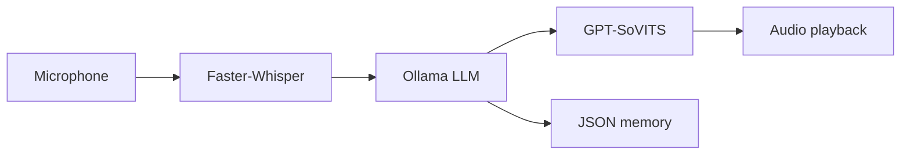

# Byulie

**A personal, local voice assistant built on Windows — for learning, not distribution.**

Byulie is my hands-on exploration of how a voice AI pipeline fits together: speech recognition, language modeling, speech synthesis, and lightweight memory — all running on my own machine without paid or hosted AI APIs.

---

## Contents

- [Overview](#overview)
- [Pipeline](#pipeline)
- [Stack](#stack)
- [Prerequisites](#prerequisites)
- [Setup](#setup)
- [Configuration](#configuration)
- [Usage](#usage)
- [Troubleshooting](#troubleshooting)
- [Learning goals](#learning-goals)
- [Acknowledgments](#acknowledgments)

---

## Overview

| Layer | Default | Notes |
| --- | --- | --- |
| Operating system | Windows 11 64-bit | Primary supported target for this guide |
| Local LLM | Ollama + `qwen3:4b` | Local model runtime and default chat model |
| Speech-to-text | Faster-Whisper | Local ASR; default config uses `base.en` on CPU |
| Text-to-speech | Local GPT-SoVITS server | Local voice server expected at the configured endpoint |
| Memory | Local JSON file | Default conversation history stored in `byulie_chat_history.json` |
| Configuration | `character_config.yaml` | Controls LLM, ASR, TTS, prompt, and memory settings |

## Windows 11 64-bit Prerequisites

Byulie is intentionally targeted at Windows 11 64-bit. Install these before running Byulie:

- **Windows 11 64-bit**.
- **64-bit Python 3.10 or Python 3.11 for Windows**.
  - During installation, enable **Add Python to PATH**.
  - Verify with `python --version` in PowerShell.
  - The launcher rejects 32-bit Python because the audio and local AI dependencies are intended for 64-bit Windows.
- **Git for Windows**.
  - Verify with `git --version`.
- **FFmpeg on PATH**.
  - Install FFmpeg and make sure `ffmpeg.exe` is available from PowerShell.
  - Verify with `ffmpeg -version`.
- **Ollama for Windows**.
  - Install from <https://ollama.com/download/windows>.
  - Verify with `ollama --version`.
- **GPT-SoVITS installed locally**.
  - Byulie expects a local GPT-SoVITS HTTP server, not a hosted TTS service.
- **Optional NVIDIA GPU acceleration**.
  - Install a current NVIDIA driver for your GPU.
  - Install CUDA only if the local components you run require it.
  - If VRAM is limited, keep Faster-Whisper on CPU and use smaller Ollama models.

## Recommended Hardware

Byulie can run with CPU-heavy defaults, but voice generation and local LLM inference are smoother with a dedicated NVIDIA GPU.

Suggested starting point:

- 16 GB system RAM or more.
- NVIDIA GPU with 8 GB VRAM or more for a more comfortable local AI workflow.
- SSD storage for model caches and faster startup.
- Working microphone and speakers/headphones.

For 8 GB VRAM systems, start with `qwen3:4b` before trying larger local models. Running a larger LLM, Faster-Whisper on GPU, and GPT-SoVITS at the same time may exceed available VRAM.

| Principle | Detail |
| --- | --- |
| **Scope** | Personal study project — private, experimental, not maintained for public use |
| **Platform** | Windows 11 64-bit (primary target) |
| **Privacy** | No paid APIs, no hosted inference — Ollama, Faster-Whisper, and GPT-SoVITS stay on `127.0.0.1` |
| **Config** | `character_config.yaml` controls LLM, ASR, TTS, prompts, and memory |

---

## Pipeline



1. Audio is captured from the microphone.
2. **Faster-Whisper** transcribes speech locally.
3. **Ollama** (`qwen3:4b` by default) generates a reply.
4. **GPT-SoVITS** synthesizes voice output locally.
5. The exchange is appended to `byulie_chat_history.json`.

---

## Stack

| Layer | Default | Role |
| --- | --- | --- |
| OS | Windows 11 | Development and runtime environment |
| LLM | Ollama + `qwen3:4b` | Local chat completion |
| ASR | Faster-Whisper `base.en` (CPU) | Speech-to-text |
| TTS | GPT-SoVITS @ `:9880` | Text-to-speech |
| Memory | `byulie_chat_history.json` | Conversation history |
| UI | Gradio (`client/app.py`) | Optional local web interface |

**Suggested hardware:** 16 GB RAM, SSD, working mic/speakers. An NVIDIA GPU with 8 GB+ VRAM helps; on 8 GB VRAM, keep ASR on CPU and start with `qwen3:4b`.

---

## Prerequisites

Install and verify before setup:

| Requirement | Verify |
| --- | --- |
| Python 3.10 or 3.11 (PATH enabled) | `python --version` |
| FFmpeg on PATH | `ffmpeg -version` |
| [Ollama for Windows](https://ollama.com/download/windows) | `ollama --version` |
| GPT-SoVITS (local install + HTTP server) | Endpoint reachable at configured URL |
| NVIDIA driver *(optional)* | `nvidia-smi` |

---

## Setup

Run from the **project root** in PowerShell.

### 1 · Virtual environment

```powershell
python -m venv .venv
.\.venv\Scripts\Activate.ps1
python -m pip install --upgrade pip
```

If activation is blocked:

```powershell
Set-ExecutionPolicy -ExecutionPolicy RemoteSigned -Scope CurrentUser
```

### 2 · Dependencies

```powershell
pip install -r requirements.txt
pip install -r extra-req.txt
```

### 3 · Ollama model

```powershell
ollama pull qwen3:4b
ollama serve
```

Confirm in a second window: `ollama run qwen3:4b` (exit when done).

### 4 · GPT-SoVITS

Start your local GPT-SoVITS server so it matches the default endpoint:

```text
http://127.0.0.1:9880/tts
```

Keep the GPT-SoVITS server running while Byulie is active.

### 7. Run Byulie

The easiest Windows launcher is the included batch file. Double-click it from File Explorer, or run it from PowerShell in the project root:

```powershell
.\start-byulie.bat
```

The launcher calls `scripts/start_byulie.ps1`, creates `.venv` if needed, installs `requirements.txt`, checks whether Ollama is available, and then starts the voice chat. You can also run the Python entry point manually after activating the virtual environment:

```powershell
python server/main_chat.py
```

Expected runtime flow:

1. Byulie starts the chat loop.
2. The microphone captures your speech.
3. Faster-Whisper transcribes the recorded audio locally.
4. Ollama generates a local response with `qwen3:4b`.
5. GPT-SoVITS generates the voice response locally.
6. Byulie plays the generated audio and updates local JSON memory.

### 8. Launch the Local Web Interface (Optional)

From the repository root on Windows, launch the web interface with:

```powershell
.\start-byulie.bat -Mode web
```

You can also run it manually with the virtual environment activated:

```powershell
python client/app.py
```

Gradio prints a local browser URL such as:

---

## Configuration

Settings live in `character_config.yaml` at the project root.

```yaml
character:
  name: Byulie

history_file: byulie_chat_history.json

llm:
  provider: ollama
  base_url: "http://127.0.0.1:11434"
  model: "qwen3:4b"
  temperature: 0.8
  max_output_tokens: 512
  context_tokens: 8192
  timeout_seconds: 120

asr:
  model: "base.en"
  device: "cpu"
  compute_type: "float32"

presets:
  default:
    system_prompt: |
      You are a helpful assistant named Byulie.
      You speak like a snarky anime girl.
      Always refer to the user as "senpai".

tts:
  provider: gpt-sovits
  endpoint: "http://127.0.0.1:9880/tts"
  text_lang: en
  prompt_lang: en
  ref_audio_path: "character_files/main_sample.wav"
  prompt_text: "This is a sample voice for you to just get started with because it sounds kind of cute but just make sure this doesn't have long silences."
```

| Key | Must align with |
| --- | --- |
| `llm.base_url` | Running Ollama instance |
| `llm.model` | Model pulled via `ollama pull` |
| `tts.endpoint` | Local GPT-SoVITS server URL |
| `tts.ref_audio_path` | Existing reference audio on disk |
| `asr.device` | `cpu` recommended when VRAM is tight |

---

## Usage

Activate the virtual environment first: `.\.venv\Scripts\Activate.ps1`

### Voice chat (CLI)

```powershell
python server/main_chat.py
```

Press **Enter** to start recording, **Enter** again to stop. Byulie transcribes, replies, synthesizes speech, and updates memory.

### Web interface (optional)

```powershell
python client/app.py
```

Open the URL Gradio prints (typically `http://127.0.0.1:7860`). The UI binds to localhost only.

Supports typed chat, microphone input, model/temperature controls, system prompt editing, and emotion/tone hints for TTS.

---

## Troubleshooting

<details>
<summary><strong>Microphone not detected</strong></summary>

- Confirm input device: **Settings → System → Sound → Input**
- Allow mic access: **Settings → Privacy & security → Microphone**
- Close apps holding exclusive mic access; test with Windows Sound Recorder
- Verify FFmpeg: `ffmpeg -version`

</details>

<details>
<summary><strong>Ollama not reachable</strong></summary>

- `ollama --version` · `ollama list` · `ollama pull qwen3:4b`
- Start manually: `ollama serve`
- Config must point to `http://127.0.0.1:11434` unless you changed the port

</details>

<details>
<summary><strong>GPT-SoVITS / no voice output</strong></summary>

- Confirm the TTS server is running at `http://127.0.0.1:9880/tts` (or your configured endpoint)
- Check `tts.ref_audio_path` exists and language fields match your model
- Restart GPT-SoVITS after changing reference audio or ports

</details>

<details>
<summary><strong>Faster-Whisper download or cache errors</strong></summary>

- Ensure venv is active and dependencies are installed
- Allow initial model download; free disk space if needed
- Fallback in config:

```yaml
asr:
  model: "tiny.en"
  device: "cpu"
  compute_type: "float32"
```

</details>

<details>
<summary><strong>CUDA / VRAM issues</strong></summary>

- Keep ASR on CPU; stay on `qwen3:4b` until stable
- Monitor VRAM: `nvidia-smi`
- Close other GPU-heavy applications before running LLM + TTS together

</details>

---

## Learning goals

This repository documents work I am doing as a **Computer Science student** to understand applied ML systems end to end:

- Wiring **ASR → LLM → TTS** into one coherent loop
- Running inference **locally** and managing model/resource tradeoffs
- Persisting **conversation state** without external databases (MVP)
- Building a minimal **UI layer** (Gradio) on top of the same backend
- Iterating on prompts, voice reference audio, and configuration-driven behavior

Planned personal experiments include lower-latency mic input, richer memory, and tighter emotion control for synthesis.

| Status | Item |
| --- | --- |
| Done | Gradio web UI |
| Done | Emotion / tone controls in UI |
| In progress | Voice chat loop refinement |
| Planned | Live microphone mode |
| Planned | SQLite memory store |
| Planned | VRM frontend exploration |

---

## Acknowledgments

Built with open tools I am learning from — not a fork or product release:

- [Ollama](https://ollama.com/) — local LLM runtime
- [Faster-Whisper](https://github.com/SYSTRAN/faster-whisper) — speech recognition
- [GPT-SoVITS](https://github.com/RVC-Boss/GPT-SoVITS) — voice synthesis

---

<p align="center"><sub>Private personal project · Windows · local inference only</sub></p>
